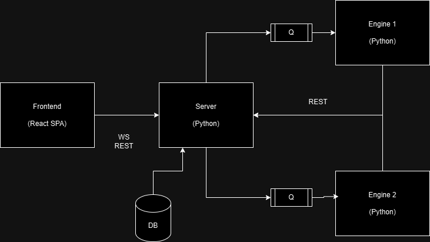

# Architecture

To edit this picture, edit [this](../assets/pwr-studio-architecture.drawio) file in [app.diagrams.net](https://app.diagrams.net) 

PwR Studio consists of the following components:
1. Frontend - Reactjs single page application that the user interacts with.
2. Server - FastAPI (Python) based REST and WebSocket based server
3. Engines - Domain specific engines that process user's utterance and convert them into DSL, Code, NLR, etc.
