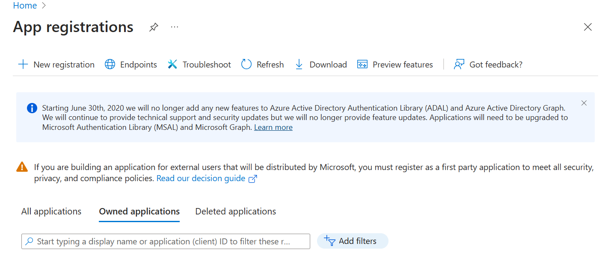
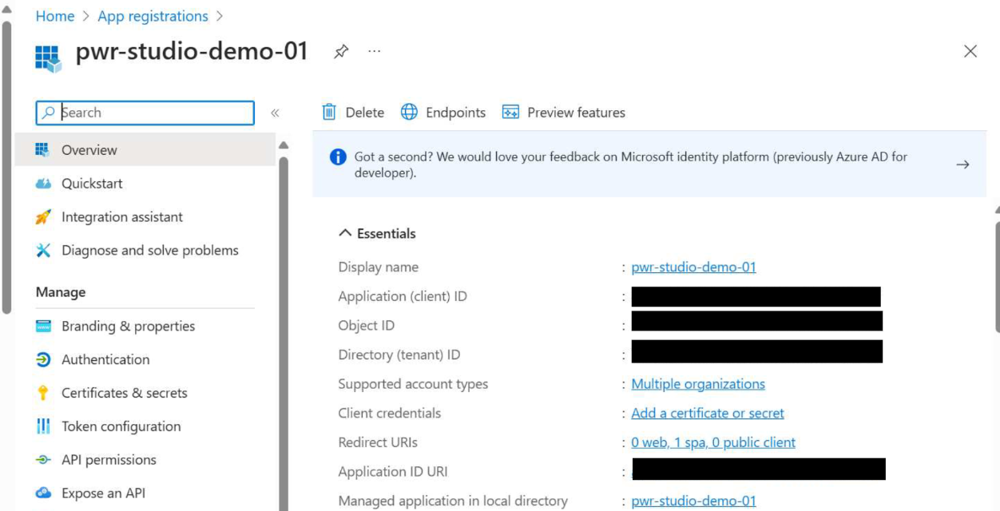

The Microsoft Authentication Library (MSAL) keys are required to authenticate users in the PwR Studio. Follow the instructions below to generate the keys.

In the .env-dev file, you need 5 keys:
`AAD_APP_CLIENT_ID=`
`AAD_APP_TENANT_ID=`
`AAD_APP_REDIRECT_URI=`
`ADD_APP_SCOPE_URI=`
`ISSUER=`

You can follow the steps below to generate the keys:
1. You first need to Register on Azure Portal. Go to [Azure Portal](https://portal.azure.com/).
2. Then sign-in to [Microsoft Entra admin center] (https://entra.microsoft.com/).
3. In the left pane, go to Identity > Applications > App Registration.
4. On the App Registration page, click on New Registration.(Top left corner)
5. Now, fill in the details for the application registration.
   
   1. Enter the name for the application.
   2. Supported account types: Select the account type that you want to support.
      1. You can select the account type as Single Tenant or Multitenant.
      2. `Single Tenant`: If you want to restrict the application to a single tenant.
      3. `Multitenant`: If you want to allow the application to be used by any tenant.
        If you don't have a specific requirement, you can select Multitenant.
        `Accounts in any organizational directory (Any Microsoft Entra ID tenant - Multitenant)`
   3. Redirect URI
      1. Select a Platform: The platform that you want to use for the application. For PwR Studio Select: `Single-page application (SPA)`.
      2. URI: Requires a redirect URI where the user will be redirected after authentication. As our studio runs on localhost, you need to provide a localhost URI. e.g. `https://localhost:3000/`
      3. Set this URI in the .env-dev file as `AAD_APP_REDIRECT_URI`. 
    4. Click on Register.
6. After registration, you will be redirected to the application page.
    
   1. In the Right pane, in the `Overview` section; you will see the **Application (client) ID**. Copy the Application (client) ID and paste it in the .env-dev file as `AAD_APP_CLIENT_ID`.
   2. Similarly for the **Directory (tenant) ID**, copy the Directory (tenant) ID and paste it in the .env-dev file as `AAD_APP_TENANT_ID`.
   3. Now, Click on the `Application ID URI` and that will generate a URI. Copy the URI and paste it in the .env-dev file as `ADD_APP_SCOPE_URI`.
7. Set `ISSUER` as `https://sts.windows.net/{AAD_APP_TENANT_ID}/`.
8. Save the .env-dev file.