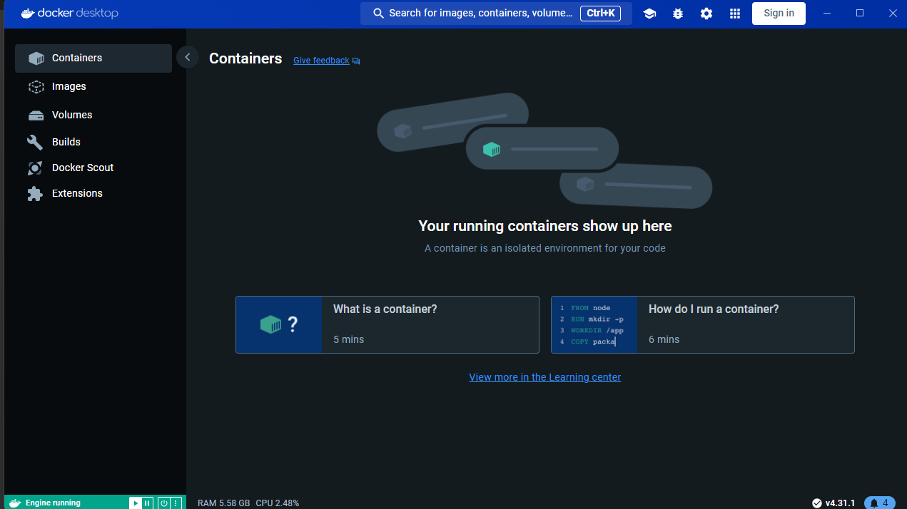
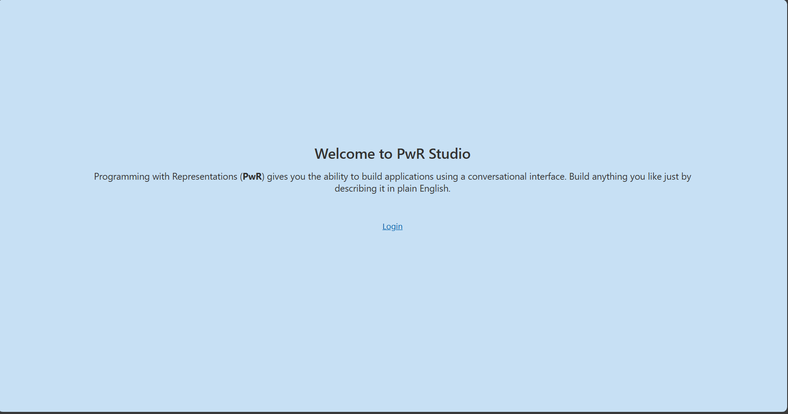
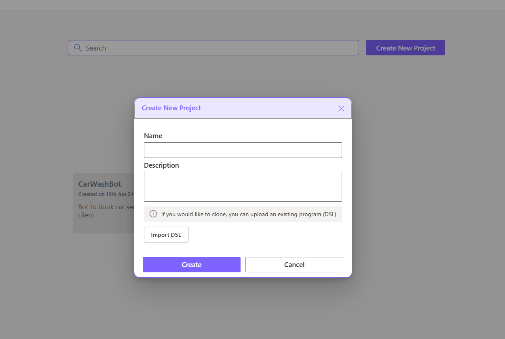
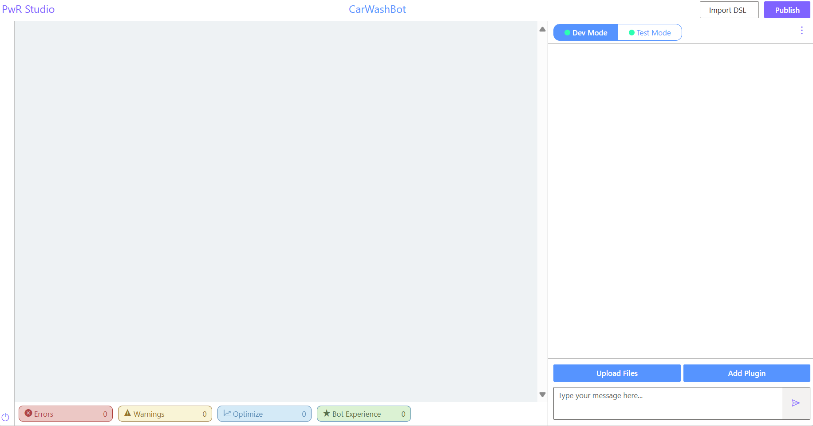
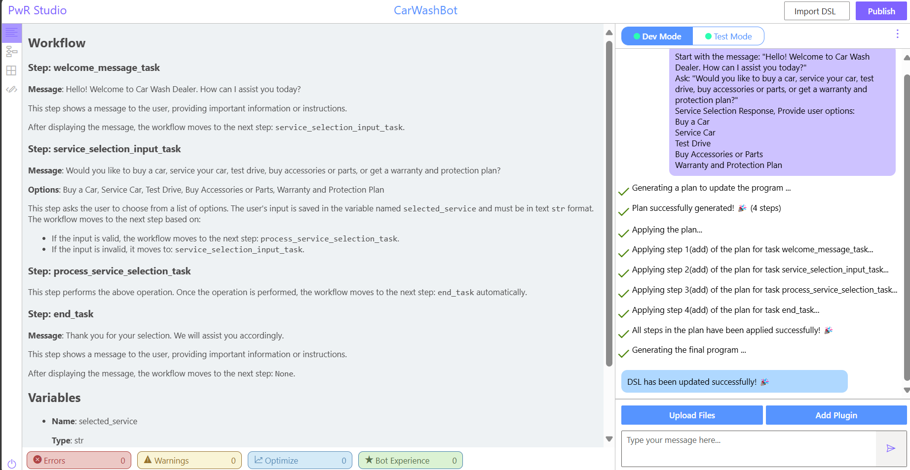
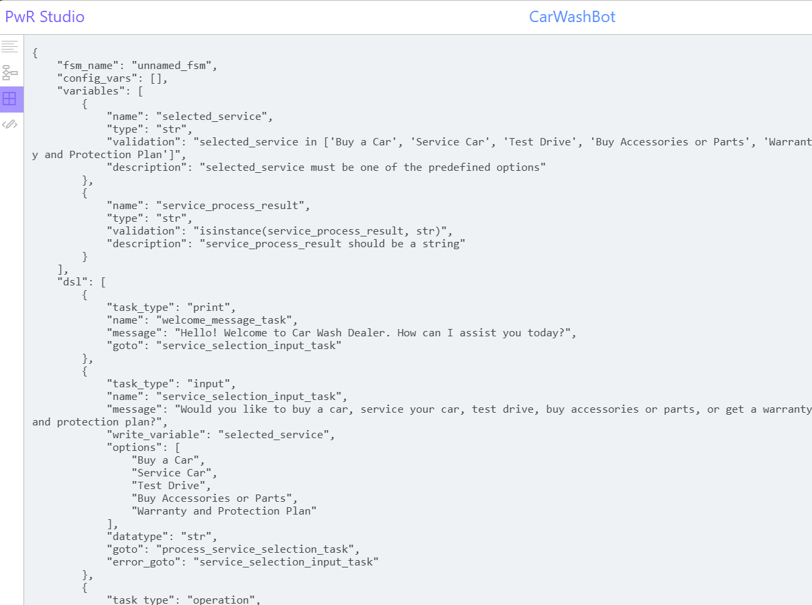
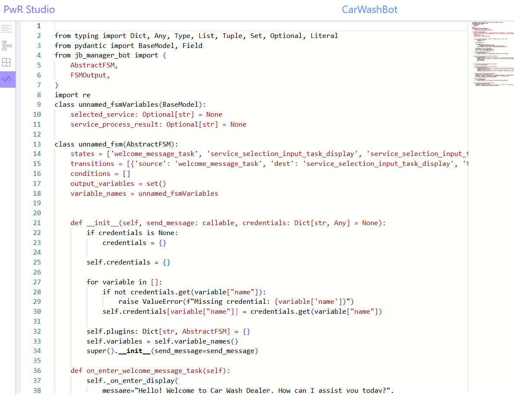

This tutorial will help you setup PwR Studio on your local computer to create [Jugalbandi Apps](https://github.com/OpenNyAI/Jugalbandi-Studio-Engine).

---

# QuickStart Guide for Setting up PwR-Studio 🎉

## Prerequisites

1. **OpenAI or Azure OpenAI Keys:** Obtain from [OpenAI](https://beta.openai.com/signup/) or [Azure](https://portal.azure.com/). Remember to comment out AZURE keys if you are not using them.

```bash
OPENAI_API_KEY=

# use the keys below instead if using Azure OpenAI
# AZURE_OPENAI_API_KEY=
# AZURE_OPENAI_ENDPOINT=
# AZURE_OPENAI_API_VERSION=
# AZURE_OPENAI_DEPLOYMENT_NAME=
```
2. **Docker:** Install [Docker Desktop](https://www.docker.com/products/docker-desktop) for Windows and Mac or [Docker Engine](https://docs.docker.com/engine/install/) for Linux.

3. **Microsoft Authentication Library (MSAL) Keys:** Read the instructions on this subsection, [Register the application and record identifiers](./msal.md) and get the following keys:

```bash
AAD_APP_CLIENT_ID=<uuid>
AAD_APP_TENANT_ID=<uuid>
AAD_APP_REDIRECT_URI="http://localhost:3000"
ADD_APP_SCOPE_URI="api://<uuid>/Users.Create"
ISSUER="https://sts.windows.net/<uuid>/"
```

## Instructions

1. **Start Docker:**
   - Ensure Docker Desktop is running.



2. **Open Bash Terminal:**
   - For Windows, use WSL2. **Note:** PowerShell will not work.

You need to setup 3 repositories to start the PwR Studio. Follow the instructions below to clone the repositories. Keep the repositories in the same directory as siblings. **Note:** Do not clone in your Windows directory as that will change the line endings.

3. **Clone PwR-Studio Repository:**
   ```bash
   git clone git@github.com:microsoft/PwR-Studio.git
   ```
   - **Note:** If you encounter the following error, your SSH setup is incorrect. Follow the instructions [here](https://docs.github.com/en/github/authenticating-to-github/connecting-to-github-with-ssh).

     ```bash
     Permission denied (publickey).
     fatal: Could not read from remote repository.

     Please make sure you have the correct access rights
     and the repository exists.
     ```

4. **Clone [JB-Studio-Engine](https://github.com/OpenNyAI/Jugalbandi-Studio-Engine) Repository:**
   ```bash
   git clone git@github.com:OpenNyAI/Jugalbandi-Studio-Engine.git
   ```


5. **Clone [PwR-NL2DSL](https://github.com/microsoft/PwR-NL2DSL) Repository:**
   ```bash
   git clone git@github.com:microsoft/PwR-NL2DSL.git
   ```

Great job! You have successfully cloned the repositories. 🎉

Your directory structure should look like this:
   ```bash
   ├── Jugalbandi-Studio-Engine
   ├── PwR-NL2DSL
   └── PwR-Studio
   ```

6. **Setup Local Environment Variables:**
   1.  Go into `PwR-Studio` repository
      
      ```bash
      cd PwR-Studio
      ```

   1. Copy `env-dev.template` to `.env-dev`:
      ```bash
      cp .env-dev.template .env-dev
      ```
   2. Enter your OpenAI or Azure OpenAI credentials in the `.env-dev` file. Remember to comment out AZURE keys if you are not using them.

      ```bash
      OPENAI_API_KEY=

      # use the keys below instead if using Azure OpenAI
      # AZURE_OPENAI_API_KEY=
      # AZURE_OPENAI_ENDPOINT=
      # AZURE_OPENAI_API_VERSION=
      # AZURE_OPENAI_DEPLOYMENT_NAME=
      ```

   3. Enter your MSAL Auth keys.

      ```bash
      AAD_APP_CLIENT_ID=<uuid>
      AAD_APP_TENANT_ID=<uuid>
      AAD_APP_REDIRECT_URI="http://localhost:3000"
      ADD_APP_SCOPE_URI="api://<uuid>/Users.Create"
      ISSUER="https://sts.windows.net/<uuid>/"
      ```

   3. Set the `KAFKA_ENGINE_TOPIC` to `jb`
   
      ```bash
      KAFKA_ENGINE_TOPIC=jb
      ```


## Steps to Setup PwR Studio -- (First Time Setup)🚀

We have script files to start the PwR Studio. You can use the following commands to start the PwR Studio.

1. **Create a dump file to import:**
   Create dump file
      ```bash
      cat ./scripts/backup.sql > dump.sql
      cat ../Jugalbandi-Studio-Engine/backup.sql >> dump.sql
      ```

2. **Setup the queues (Kafka):**
   1. First start a Kafka container using the following command:
      ```bash
      ./scripts/run.sh kafka
      ```
      Note: Keep the kafka container running in the background. Until you run the next command, do not stop the kafka container.

   2. Next, create a kafka topic `jb` using the following command:
      ```bash
      ./scripts/create-topic.sh jb
      ```
Note: If you encounter any error then delete all the images, containers and volumes from Docker and try again from start.

4. **Start the PwR Studio:**
   ```bash
   ./scripts/run.sh server studio engine
   ```
   - **Note:** You need to run the above command twice to start both the PwR Studio and the engine. First time, let the server start completely and then stop (`Ctrl + C`) it. Then run the command again to start the engine.

---
## Start PwR Studio 🚀
Make sure that you have done the first time setup before starting the PwR Studio.
1. **Start PwR Studio:**
   - Run the following command to start the PwR Studio:
     ```bash
     ./scripts/run.sh server studio engine
     ```
2. **Open PwR Studio in Browser:**
   - Go to `http://localhost:4173`
   
   You are all set now for the next step on building Jugalbandi Apps! 🎉
---

## Building Jugalbandi Apps

1. **Login to PwR Studio:**
   - Click on the `Log In` button on the home page.

2. **Create a New Project:**
   - Click on the `Create New Project` button on the home page.
   - Enter the project `Name` and `Description` and click on `Create`.
   - 

3. **Start Page for Project:**
   - You will be redirected to the project page.
   - 
   - You can use text box in the right side to enter the steps/text to build your bot.

4. **Outputs**
   - You can see the outputs of the bot in the right side of the page.
   - There are 4 tabs in the left top section:
   
      <!--  -->
   - `Natural Language Representation` - You can see the description of the steps in natural language.
   - 
   - `Flow` - You can see the flow of the steps in the form of JSON.
   - 
   - `Chart` - You can see the flow of the steps in the form of a flow-chart.
   - `Code` - The final code generated based on the flow.
   - 

  
